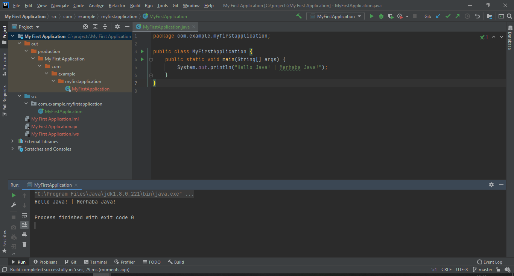

## Java ile İlk Uygulama

### Komut Satırı ile İlk Uygulama

Bilgisayarımızda herhangi bir IDE olmadan da yazılan Java kodları derlenip, çalıştırılabilmektedir. Bunun için bir yazı editörü ve Java'nın sisteminizde yüklü olması yeterlidir. İlk örneğimizi bu yolla oluşturup, Java altyapısının kodu derleme, byte code'a (ara koda) dönüştürme ve sonrasında JVM vasıtasıyla yorumlayıp çalıştırılabilmesinden bahsedeceğiz. Ayrıca, yazdığımız basit Java programı hakkında kısa bilgiler vereceğiz.

Önce bir yazı editörü(notepad) açıp içine aşağıdaki kodları yazıyoruz.

```java
class MyFirstProgram{

    public static void main(String args[]){
    	System.out.println("Hello Java! | Merhaba Java!");
    }
}
```

Dosya uzantısı .txt olarak değil " .java" olarak kaydedilir. Java'da kaynak kod dosyaları ".java" uzantılıdır.

Terminal(Komut İstemi) açılır. Terminal komutları ile kaydedilen dosyanın uzantısına gidilir. Ardından, "javac dosya_adı.java" komutu çalıştırılır. Java kaynak kodumuzu derlemek (Compile) için JDK içinde yer alan "javac" isimli yazılımdan faydalanırız.

Derleme işlemi sonrasında byte code'a çevrilmiş " .class" uzantılı bir dosya üretilecektir.

byte code'a çevirme işleminden sonra, yazdığımız uygulamayı çalıştırmak istersek artık "MyFirstProgram.class" dosyasını kullanacağız. Java Virtual Machine (JVM), **ClassLoader** vasıtasıyla bu Class dosyasını yükleyecek, ardından byte code'u kontrolden geçirecek ve makine koduna çevirip çalıştırılmasını sağlayacak.

Derlenmiş olan "**MyFirstProgram.class**" dosyasını JDK içinde var olan "**java**" yazılımı ile çalıştırıyoruz. Kaynak kodun içinde yazdığımız gibi ekrana "**Hello Java! | Merhaba Java!**" ifadesini basmaktadır.

### Intellij IDE ile İlk Uygulama

İntellij IDE açılır. Açık bir java uygulaması yok ise Create New Project, var ise File -> New -> Project.. seçilir. Aşağıdaki ekran açılır. Bu ekranda oluşturduğumuz projenin ne projesi olduğu (Java,Maven,Gradle..) belirlenir. Temel Java için sol menüden Java seçilir. Project SDK alanında kurulan JDK versiyonu seçilir. Additional Libraries kısmında herhangi bir seçim yapmadan ilerlenir.


Herhangi bir template kullanmayacağımız için seçim yapmadan ilerlenir.


Project name alanına projenin ismi(mümkünse türkçe karakter kullanılmadan), Project location alanına projenin yaratılmak istenildiği path girilir.


Proje oluşturulduğunda sol tarafta projenin dizini, sağ tarafta ise kod yazacağımız alan yer alır. Dizin altında src(source) klasöründe kodlar yer alır. src üzerine sağ tıklayıp New -> Package seçilir ve yeni pakete ad verilip oluşturulur. Package oluşturmadan direkt Java Class’ı oluşturup çalıştırabilirdik fakat büyük projelerde yazdığımız kodun daha düzenli olması ve bazı erişim yetkileri için package oluşturulmalıdır. Oluşturulan package'a sağ tıklanarak New -> Java Class seçilerek oluşturulacak Java Class'ına isim verilir. Java projesinin çalışması için main method tanımlaması yapılmalıdır. Bir uygulama run edildiği an proje main method içinden başlar. O yüzden main methodu olmayan Java projelerini çalıştıramayız. Projeyi çalıştırmak için Run->Run "classismi" seçilir. Proje çalıştırıldığında JVM aracılığı ile kod bytecode'a dönüştürülerek out dizini altında .class uzantılı dosyanın oluşturulduğu görülür. main method içerisindeki çıktı konsolda görüntülenir.



"**class**" anahtar sözcüğü ile Java'da bir sınıf tanımı yaparız. Java, Nesneye Dayalı Programlama paradigmasını tamamıyla destekleyen bir dil olduğu için Java'da her şey nesnelerden oluşur. Nesne'leri ise sınıflar vasıtasıyla adeta bir taslak olarak modelleriz. Nesne ise bu taslaktan oluşturulmuş varlığı ifade eder. "class" bir sabun kalıbı ise, kalıptan üretilen her sabun ise o sınıftan üretilmiş nesnelerdir.

"**public**" anahtar sözcüğü Java'da erişim belirteci olarak kullanılır. Aslında, herkes tarafından erişebilmeyi ifade eder. Eğer, "private" olarak tanımlasaydık bu durumda dışarıdan erişilemez olacaktı.

"**static**" anahtar sözcüğü Java'da sınıftan herhangi bir nesne üretmeden ilgili değişkeni veya metodu çağırabilmeyi ifade eder. Örneğin: MyFirstProgram.createMagicObject() şeklinde nesne üretmeden direkt sınıf üzerinden bir çağrım yapabiliyorsak bu static bir metoddur.

Sınıflar içinde değişkenler ve metodlar / fonksiyonlar yer almaktadır. Böylece bir sınıfı şekillendirebiliriz. Değişkenler daha çok nitelikleri ifade ederken, örneğin: arabanın rengi, uzunluğu, genişliği gibi, metodlar / fonksiyonlar ise daha çok eylemleri ifade eder. Örneğin: startComputerMemoryCheck() isminde bir fonksiyon bilgisayar ait hafızayı kontrol etme eylemini ifade eder. Eylemler ve nitelikler gerçek hayattaki nesneleri modellememizde de kullanılır. Bu nedenle nesneye dayalı yazılım paradigması gerçek hayat problemlerinin çözümüne doğal olarak çok uygundur.

"**void**" bir metod değer döndürmeyecekse bu anahtar sözcük kullanılır. Fonksiyonlar bünyelerinde belirli aksiyonları icra ettikten sonra eğer ortaya bir sonuç çıkıyorsa bunu çağrıldıkları yere döndürebilirler. Bunlara değer döndüren fonksiyonlar denir.

"**main**" ana programin fonksiyon ismini ifade eder.

"**String[] args**" Java programı komut istemcisinden çalıştırılırken komut istemcisinden programa ekstra parametreler gönderebilirsiniz. Bu ekstra değerler "args" isimli değişken vasıtasıyla gelir.

"**System.out.println()**" JDK içinde tanımlı statik bir fonksiyondur. Konsol ekranına bir şeyler yazdırmak istenirse kullanılır.