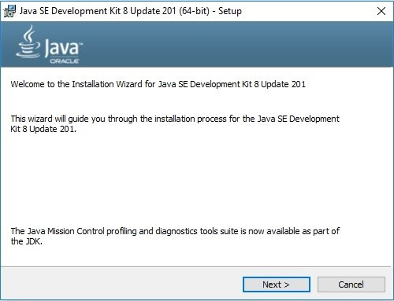
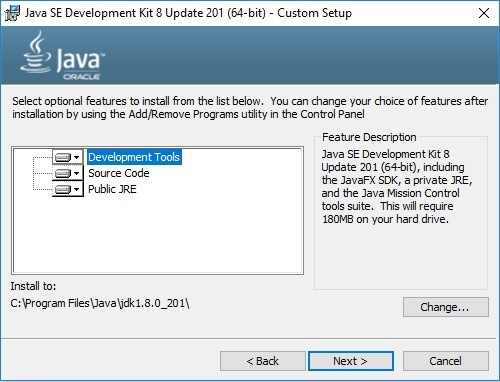
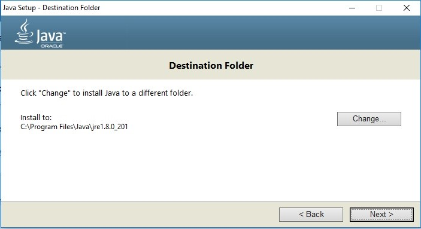
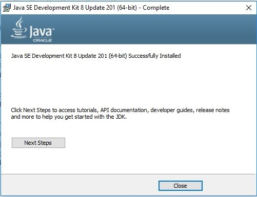
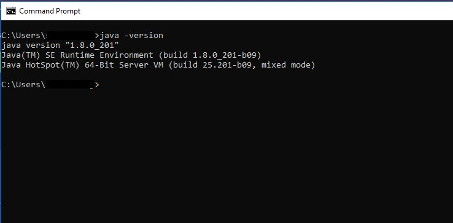
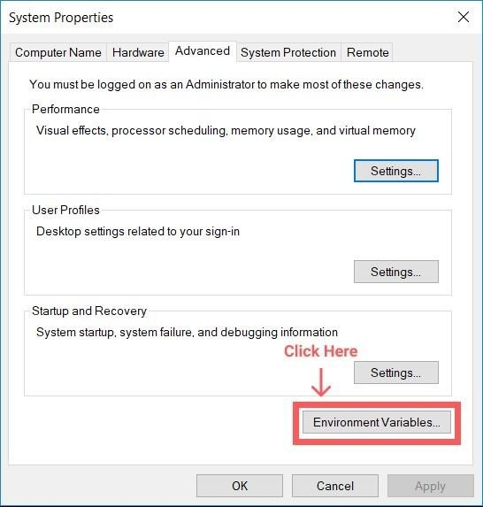
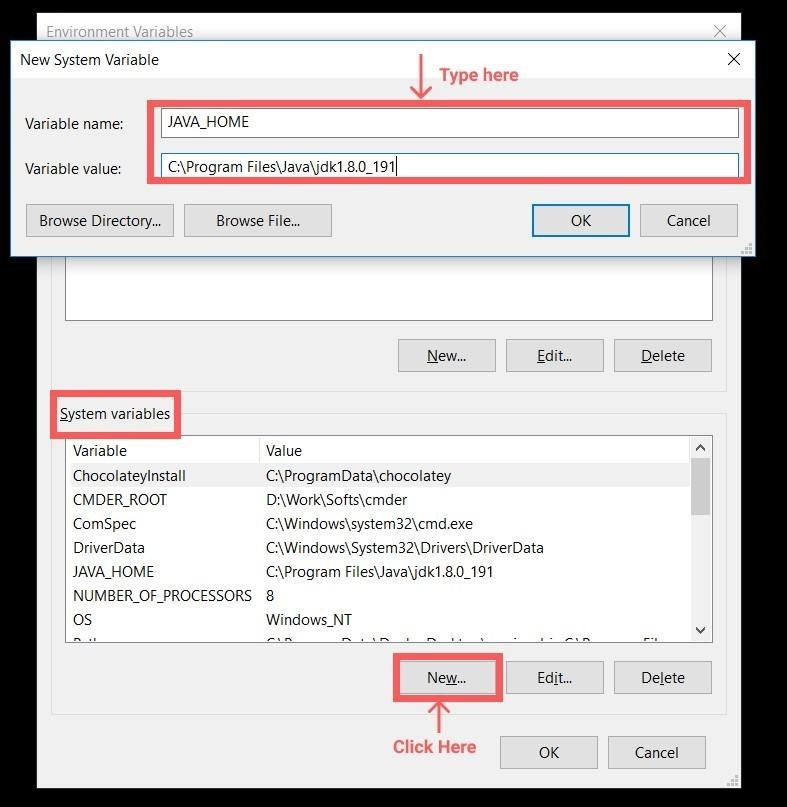
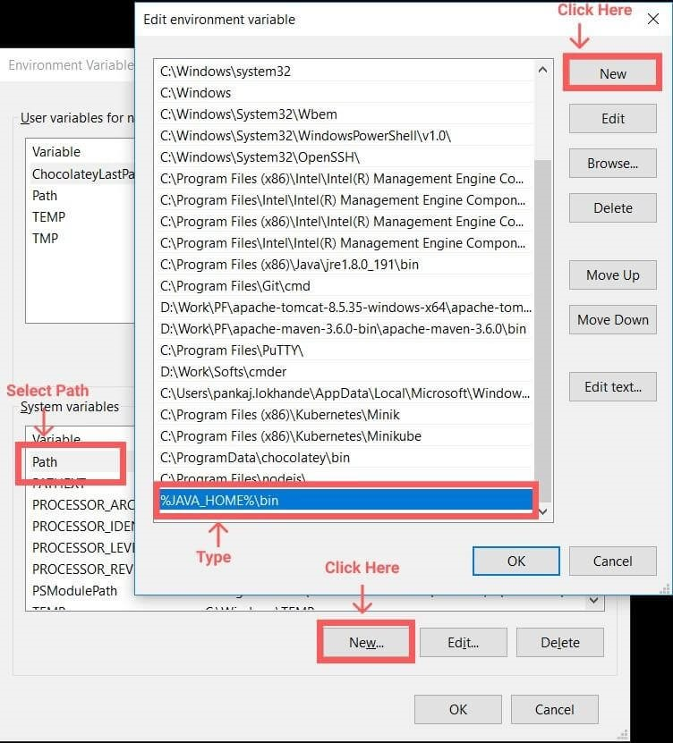

## Java Geliştirme Ortamının Kurulumu

Java ile yazılmış olan uygulamaları çalıştırabilmek için bilgisayarınıza Java Runtime Environment (JRE) kurmanız gerekmektedir. JRE uygulamaları çalıştırmak için yeterlidir. Fakat, Java ile yazılım geliştirmeyi amaçlıyorsanız. **Java Development Kit'i** (JDK) kurmanız gerekmektedir. JDK bünyesinde JRE'yi de içermektedir. Ayrıca Java ile geliştirme yapabilmeniz için gerekli kütüphaneleri ve altyapıyı sağlamaktadır. Bu konuya ileride daha derinlemesine bir şekilde ele alacağız. Eğitim boyunca JDK 8 versiyonunu kullanacağız. Şimdi Windows, Mac OS ve Linux ortamları için JDK kurulumundan bahsedelim.

### Windows İşletim Sisteminde JDK 8 Kurulumu

Aşağıdaki linkten Oracle sitesi üzerinden JDK indirme işlemini başlatabilirsiniz.

[https://www.oracle.com/java/technologies/javase/javase-jdk8-downloads.html](https://www.oracle.com/java/technologies/javase/javase-jdk8-downloads.html)

Yukarıda da görüleceği üzere işlemci tipinize göre x86 (32 Bit) / x64 (64 Bit) seçebilirsiniz. Tıklayıp sözleşmeyi kabul edip indirebilirsiniz. İndirilen .exe uzantılı dosyaya çift tıklayarak kurulumu başlatabilirsiniz.



&quot;Next&quot; seçeneği ile kuruluma devam edilir.



Yukarıdaki gibi varsayılan ayarlar bırakılır ve &quot;Next&quot; ile kuruluma devam edilir.



Yukarıda Java&#39;nın kurulacağı dosya yolu belirtilmiştir. &quot;Change&quot; butonuna tıklayarak dilediğiniz dosya yolu verebilirsiniz. &quot;Next&quot; ile kuruluma devam edilir.



JDK 8 kurulumu böylece tamamlanmış olur. Java&#39;nın sisteme doğru bir şekilde kurulduğunu kontrol için &quot;Windows > cmd&quot; yoluyla Komut İstemcisi açılır.

```terminal
>>java -version
```



Komut satırı üzerinden versiyon sorgulaması yaptığınızda yukarıdaki fotoğrafta da görüldüğü gibi eğer Java başarılı bir şekilde yüklendiyse size kısa bilgiler verecektir.

#### PATH ve JAVA\_HOME Tanımlamalarının Yapılması

Ortam değişkenleri (Environment Variables) oluşturularak işletim sistemi düzeyinde global tanımlamalar yapılabilmektedir. Java uygulamaları da işletim sistemi tarafından çalıştırılmaya başlandığında JAVA\_HOME ortam değişkenine ihtiyaç duyarlar. Varsayılan olarak işletim sisteminde tanımlı olan ortam değişkenini kullanmaya çalışırlar. Böylece, tüm Java uygulamalarını hatasız bir şekilde çalıştırma şansını yakalarız.

#### JAVA\_HOME Ortam Değişkeni Tanımlanması

JAVA\_HOME ortam değişkeni tanımlanırken JDK&#39;nin kurulu olduğu dosya dizinini vermeliyiz. JRE ve JDK&#39;nın dosya dizinleri birbirinden farklıdır.

Windows arama çubuğuna **&quot;Gelişmiş Sistem Ayarları&quot;** veya İngilizcesi ile **&quot;Advanced System Settings&quot;** yazarak erişebilirsiniz. Açılan pencerede &quot;Gelişmiş&quot; (Advanced) tabına gelerek Ortam Değişkenleri&#39;ni (Environment Variables) güncelleyebilirsiniz.



Ardından, **&quot;Sistem Değişkenleri&quot; (System Variables)** altında yer alan &quot;Yeni&quot; (New) butonuna tıklayarak JAVA\_HOME değişkenini, JDK dosya dizinini vererek tanımlayabilirsiniz.



#### PATH Tanımının Güncellenmesi

PATH değişkenleri çalıştırabilir yazılım uygulamalarının dosya yolunu işletim sistemine belirtmek için kullanılır. Örneğin: yazılacak olan Java kodlarının derlenebilmesi için &quot;javac&quot; ismindeki yazılım modülüne ihtiyaç olacaktır. JDK kurulumu ile bu uygulama sisteminize yüklenmiş olur. &quot;javac&quot; yazılım modülünü her çalıştırmak istediğinizde tam dosya yolunu da yazmak zorunda kalırsınız.

Örneğin:

```terminal
>>C:\ProgramFiles\Java\jdk-13.0.1\bin\javac ExampleSourceCode.java
```


Yukarıda da görüldüğü gibi **&quot;ExampleSourceCode.java&quot;** isimli örnek Java uygulamamızı derlemek istediğimizde tam ve kesin bir biçimde dosya yolunu vermek gerekmektedir. PATH tanımlamaları ile bu yükten kurtuluruz. &quot;javac&quot; ile derleme yapmak istediğimizde sadece aşağıdaki gibi bir komut çalıştırmak yeterli olacaktır.


```terminal
>> javac ExampleSourceCode.java
```


Yine **&quot;Sistem Değişkenleri&quot; (System Variables)** içinde yer alan &quot;Path&quot; isimli öğeyi seçilir ve &quot;Güncelle&quot; (Edit) seçeneğine tıklanır. Gelen ekranda &quot;Yeni&quot; (New) butonuna tıklayarak yeni PATH tanımı eklenir. Bu PATH tanımında bir önceki bölümde tanımladığımız &quot;JAVA\_HOME&quot; ortam değişkeni kullanılabilir. JAVA\_HOME zaten JDK&#39;nin kurulu olduğu dosya dizinini verir. **&quot;%JAVA\_HOME\bin%&quot;** şeklinde sonuna &quot;\bin&quot; gelecek şekilde ekleme yapılarak, Java işletim sisteminin PATH tanımına eklenmiş olur.

